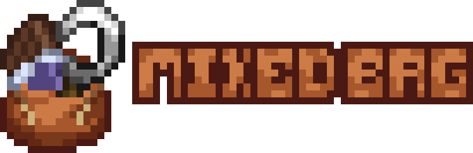

  

 

Mixed Bag is a lightweight datapack focusing on small features like food and utility items.
Features a few food items filling out their niches, a riding tool and a whole new tiered weapon!

You can view the pack features on its [wiki](https://github.com/Greytber/mixedbag/wiki)!

# Credits

[Greytber](https://modrinth.com/user/Greytber) - Lead Developer

[LeadisToxic](https://modrinth.com/user/LeadisToxic) - Main inspiration, referenced code, thallium stuff

[CreeperMagnet_](https://thecreeperscode.com/) - [maybejake](https://modrinth.com/user/maybejake) - [Conure512](https://modrinth.com/user/Conure512)
- Referenced code

[Smithed Community](https://smithed.net) - Useful libraries and conventions
